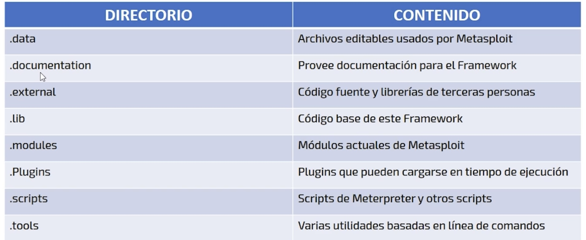

# Requerimientos de Hardware
Como sucede con cualquier tipo de software, para poder utilizarlo debemos cubur ciertos requisitos de hardware:
* Disco duro de 10 GB
* Una memoria RAM de 512 MB
* Un procesador de 400 mhz
* Acceso a internet 

Entre mayor seas los recursos de la computadora, mas agradable va sser la experiencia con la herramienta.

# Requerimientos de Software
El sistema operativo puede ser: 
* Linux (Mas recomendado)
* Windows (de manera grafica)
* Mac OSX

**Durante el desarrollo del curso lo vamos a utilizar en Kali Linux**

La mejor forma de sacarle la mayor eficienca a la herramienta es atraves de la consola y Kali Linux es perfecta en esta ocasion.

# Kali Linux
Es una distribucion avanzada, la cual esta orientada a la realizacion de pruebas de penetracion asi como auditorias de seguridad informatica

**Por defecto incluye Metasploit Framework**, configurada e instalada

### Donde se obtiene Kali linux? 
https://www.kali.org/downloads 

Lo mas recomendable es virtualizarlo con Virtual Box (Windows) o UTM Virtual Machine (MacBook) como una imagen ISO de 64 bit o una maquina preinstalda.

# Recomendaciones Especiales
Una vez ya cuente con el sistema operativo Kali Linux instalado, es recomendable actualizar el sistema completo para obtener las versiones mas recientes de la herramienta.

Comando de acctualizacion en Kali Linux usuario root
 * sudo su (acceder al usuario root)
 * apt-get update && apt-get dist-upgrade -y (actualizacion)

# Arquitectura de Metasploit
Se encuentra en:
* cd /usr/share/metasploit-famework
* ls -l o ll
  
### Sistemas de archivos
Esta diseñado de una manera intuitiva y organizada por medio de directorios.

### Librerias de Metasploit
Nos ayudan a ejecutar exploits, sin la necesidad de tener que escribir codigo adicional.

Librerias mas comunes:
* **rex** libreria usada para la mayoria de las tareas(Maneja sockets y protocolos)
* **msf:core** proporciona la api basica / define el Framework Metasploit
* **msf:Base** proporciona una api amigable y api's simplificadas para usarse en el Framework
  
# Conceptos basicos de Metsploit

### Exploit
Programa o parte pequeña de codigo que explota una vulnerabilidad en un sistema. Estos pueden darnos control total de un sistema o bien dejrlo inhabilitado.

### Expploit local
Este tipo funciona en sistemas a los que podemos acceder fisicamente.

### Exploit remoto
Este tipo funciona cuando atacamos un sistema informatico ya sea dentro o fuera de nuestra red.

# Tipos de Exploits
### 1. Exploit 0' day (muy peligrosos)

Estos explotan un fallo de seguridad y no existe forma de detenerlos, a menos que dejemos de utilizar el sisteme vulnerable.

En ocasiones no se sabe de su exitencia y este es el punto as grande en donde gira el negocio de la seguridad informatica debido a que las ganancias economicas pueden ir desde 50usd a 500.000usd

Los exploits mejor pagados son aquellos que afectan directamente a pklataformas MAC(IOS Y MAC OSX).

### 2. Auxiliary
Son modulos que nos dan funcionalidades como por ejemplo un scanner de puertos, captura de trafico de red (sniffing) obtencion de correos electronicos, etc.

### 3. Post
Dentro de post encontraremos modulos que nos permiten utilizar recursos dentro del sistema que ya esta comprometido.

### 4. Payload
Es una pieza de codigo que se ejecuta despues de que hemos explotado una vulnerabilidad dentro de un sistema y define e; tipo de acceso y las acciones que haremos cuando estemos dentro del sistema

### 5. Encoders
Son utilizados para evadir o evitar ser detectados por los antivirus, los firewalls o los sistemas detectores de intrusos (IDS), entre otros.

### 6. Nops
Se trata de una abreviacion de "no operation" esta no operacion esta escrita en leguaje ensablado, entender este tema tiene cierta complejidad.

Los Nops se utilizan para proveeder de estabilidad a nuestro payload

# Iniciar el servicio de Metasploit
### 1. Iniciar el servicio de **apache**

#### Que es apache? 
Es un web server de codigo abierto para plataformas Unix, Linux, Windows y Mac.

**NO SE USA UNICAMNETE PARA METASPLOIT**

#### De formas de levantar el web server:
1.  Utilizando el acceso directo a Metasploit que nos ofrece Kali linux
2.  Indicando la intruccion en la consola, comando: 
   * service apeche2 start
   * service apache2 status

