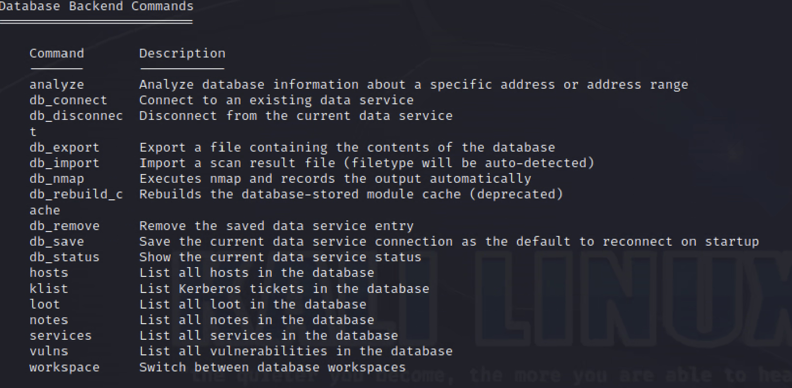
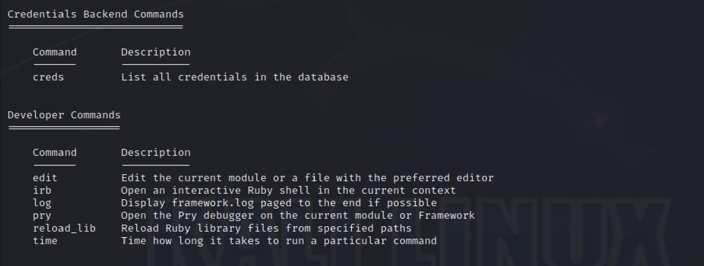
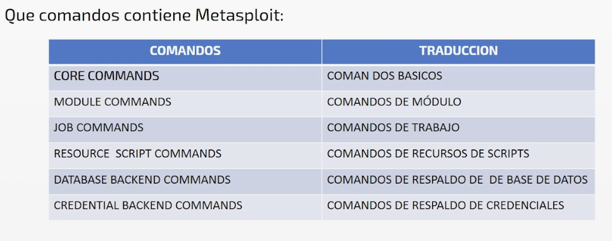
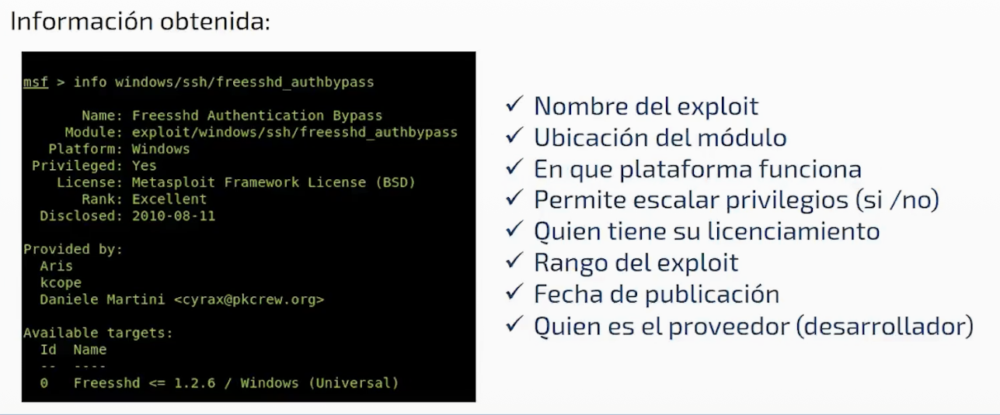
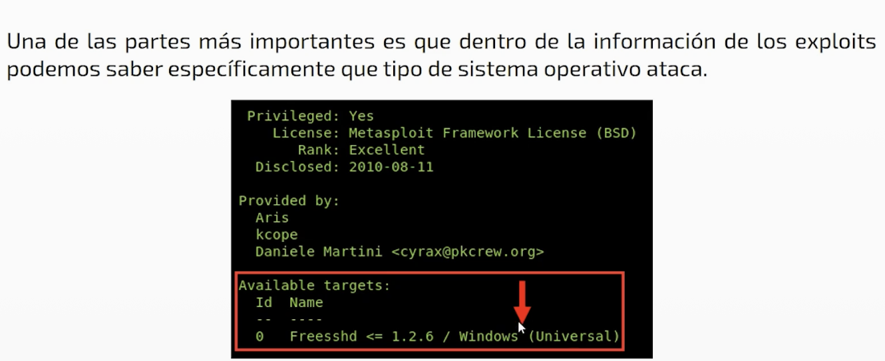
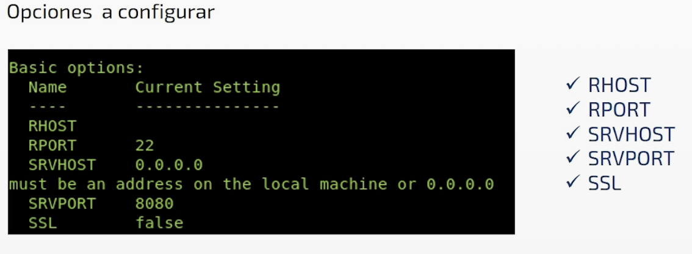
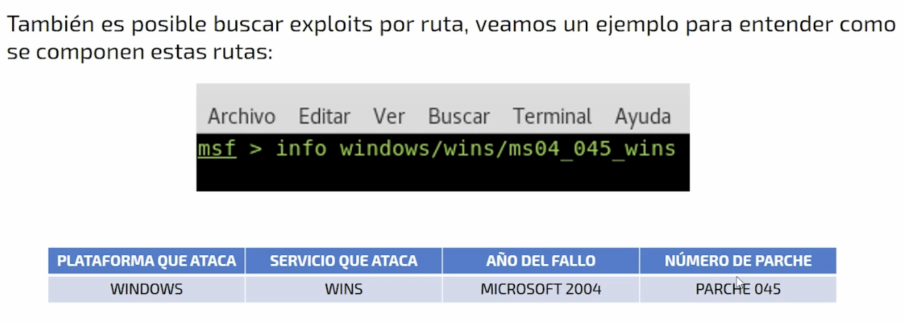

# Comandos de Metasploit 
## Iniciar Metasploit 
1. Haciendo click sobre el acceso directo
2. Usando el comando **msfconsole** en la terminal
3. Usando el comando **msfconsole -q** en la terminal (Forma silenciosa, no muestra la banners)

**Previamente iniciar apache**: service apache2 start

### Comandos  
* msfconsole -h: para ver la opciones de ayuda y diversos comandos 
* msfconsole -v: para ver la version de metasploit instalada
* help (dentro de metasploit)
  
  

* msfupdate: actualizacion solo de metasploit
* show nops
* info "nombre del modulo"

* search "nombre del prodcuto a buscar": para realizar busquedas filtradas.**Ejemplo: search ios**
* info "nombre del exploit":Buscar exploits por ruta

* search path: gather "nombre":forma de buscar fallos 
* search platform:android/ios/windows/linux
* search type:post : busquedas por odulos de forma especifica 
* search cve:2017 : busquedas por fecha

## CVE
Es una lista de vulnerabilidades de seguridad de la informacion publicamente conocidas. Es quizas el estandar mas usado. Permite identificr cada vulnerabilidad asignando a cada una un codigo de identificacion unico.

La pagina ofical es: 
https://cve.mitre.org/

Sin embargo Metasploit puede conectarse a este sitio web y mostrar en consola las vulnerabilidades especificas por año. 

**Comando:** search cve:2017 : busquedas por fecha
