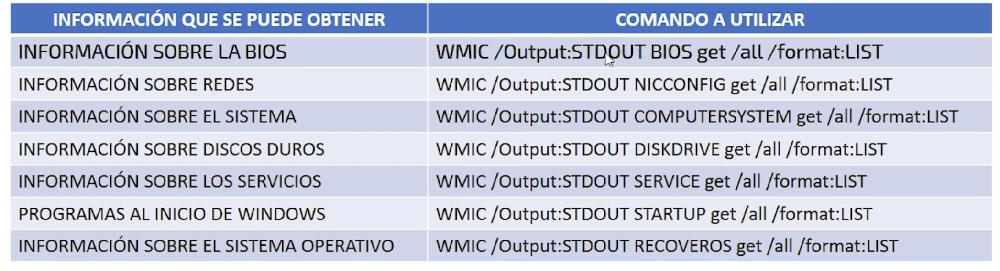
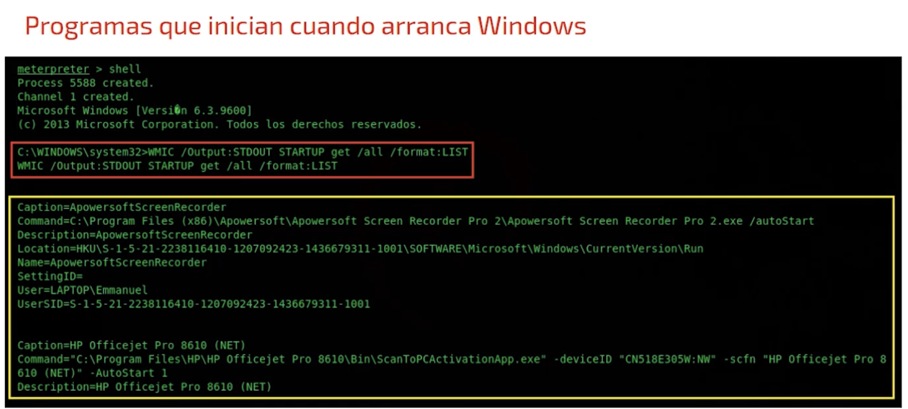

# Interaccion rempota con Windows

### Comando wmic
Se trata de un comando de consola que permite acceder a funciones admi dentro del sistema operativo wndows.

Las funciones admi de este comando pueden ejecutarse de forma local o de forma remota

* wmic/?

### Que info proporcona WMIC?
Es un comando muy potente ya que nos permite obtener info sobre el sitema comprometido

Para ejecutar el comando y obtener los resultados que se desean es de suma importacia estar ubucados en la carpeta **sistema 32**, de otro modo pueden haber fallos 

### Requisistos para utilizar el comando WMIC
* Contar con una sesion de Meterpreter activa
* Contar con privilegios system
* Acceder a una shell remota 

Una vez logrado acceder a la shell de windows desde la sesion de meterpreter podemos ejecutar de forma remota diversos comandos que nos permitan conocer info sobre el sistema

**Todas las consultas con wnic pasan inadvertidas**

### Info obtenida con wmic

### Funciones

* Conocer la lista de programas que estan instalados en el equipo comprometido
* Desinstalar alguno de estos programas 
  
Esto nos permite manipular de cierto modo el sistema para faciliarnos tareas como por ejemplo poder implantar una persistencia dentro del equipo comprometido 

Para poder invocar la lista de progrmas instaldos dentro del equipo y haciendo uso de la shell remota de windows, usamos el siguinete comando:

`wmic product get name`

Este comando lo que hace es extraer la lista de programas instalados dentro del equipi con sus versiones y mostrarlos en pantalla

Comando para desistalar:

`wmic product where name= "NOMBRE DEL LO QUE SE VA A DESINSTALAR" call uninstall/nointeractive`

